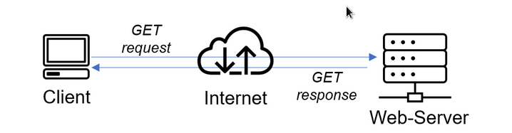
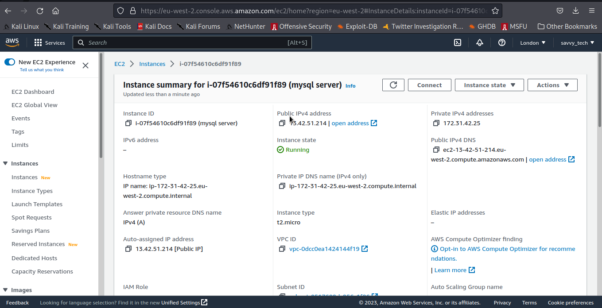
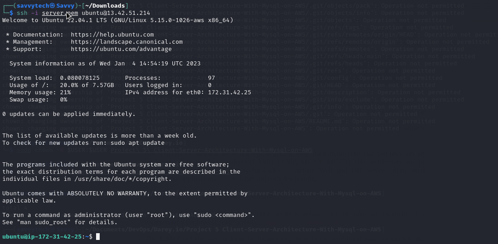

# IMPLEMENT A CLIENT SERVER ARCHITECTURE ON AWS USING MYSQL DATABASE MANAGEMENT SYSTEM (DBMS).
This Repository explains the step involved in setting up client-server architecture with Mysql on AWS.

Client-Server refers to an architecture in which two or more computers are connected together over a network to send and receive requests between one another.
In their communication, each machine has its own role: the machine sending requests is usually referred as "Client" and the machine responding (serving) is called "Server".

A simple diagram of Web Client-Server architecture is presented below:

### Create and configure two Linux-based virtual servers (EC2 instances in AWS).
Name the first server "mysql server" and the second server "mysql client"

* Login to the AWS console
* Search for EC2 (Elastic Compute Cloud) 
* Select your preferred region (the closest to you) and launch a new EC2 instance of t2.micro family with Ubuntu Server 20.04 LTS (HVM)
* Type `mysql server` as the name of the server
 Click create a new key pair, use any name of your choice as the name for the pem file and select .pem.
    * Linux/Mac users, choose .pem for use with openssh. This allows you to connect to your server using open ssh clients.
    * For windows users choose .ppk for use with putty. Putty is a software that lets you connect remotely to servers
* Save your private key (.pem file) securely and do not share it with anyone! If you lose it, you will not be able to connect to your server ever again! 

* Now, the the first server named "mysql server" has been created.

    

* On your local computer, open the terminal and change directory to the Downloads folder, type 
    > `cd ~/Downloads `
* Change permissions for the private key file (.pem), otherwise you will get an error “Bad permission”
    > `sudo chmod 0600 <private-key-name>. pem `

    

* Connect to the instance by running
    > `ssh -i <private-key-name>. pem ubuntu@<Public-IP-address>`

    
    

